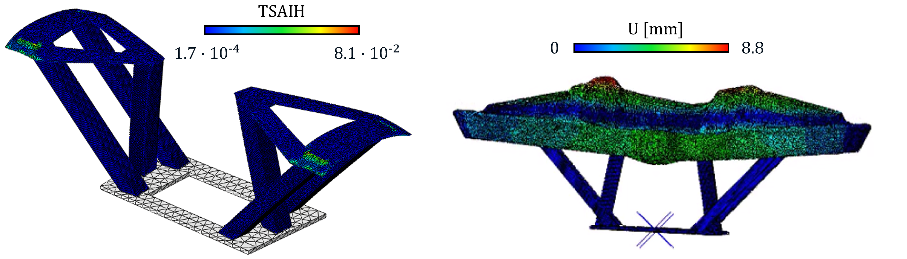

# Structural Validation & Modal Analysis of a Composite Marine Console 🚤🔧

*Figure 1: Side-by-side design validation. Left: Static stress verification (Tsai-Hill Index) confirming structural safety. Right: Modal frequency analysis identifying a localized dynamic risk at 70.47 Hz.*

## 📌 Executive Summary
This project demonstrates a complete structural validation loop for a composite marine console. The primary engineering directive was to achieve a **20% overall weight reduction** to optimize manufacturing costs and vessel dynamics, without compromising operational safety and compliance.

The analysis highlights a classic engineering trade-off: while the lightweight design successfully passed static failure criteria, the resulting reduction in global stiffness introduced a dynamic vulnerability (resonance) that requires targeted mitigation before production sign-off.

## 🎯 Key Engineering Activities & Decision Making

* **Stiffness-Driven Optimization:** Managed the weight reduction process by prioritizing maximum deformation constraints (2mm). Achieved the 20% mass reduction target while ensuring structural deflections remained strictly within naval operational limits.
* **Static Risk Assessment:** Evaluated the composite laminate integrity against extreme operational loads. The Tsai-Hill failure index mapping validated that the structure has a very low risk of static failure.
* **Dynamic Vulnerability Detection:** Conducted a modal analysis to prevent future NVH (Noise, Vibration, and Harshness) issues. Identified a critical localized resonance at **70.47 Hz**, which falls within the typical engine excitation range (62.5-81.4 Hz), flagging it for necessary local reinforcement prior to manufacturing.

## 🛠️ Skills & Methodologies Applied
* **Core Competencies:** Structural Validation, Design Trade-off Analysis, Risk Assessment, Composite Materials.
* **Technical Tools:** Abaqus (FEA), Post-Processing & Data Visualization.
* **Application Domain:** Naval/Marine Engineering, Structural Integrity, NVH Testing preparations.
